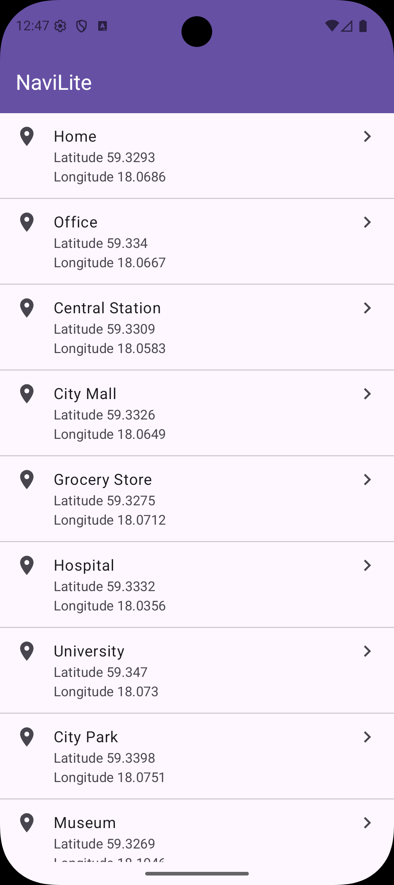
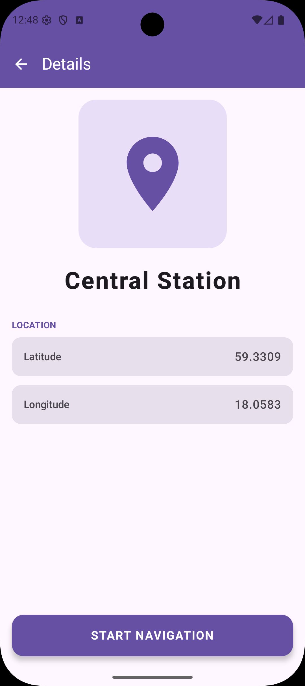
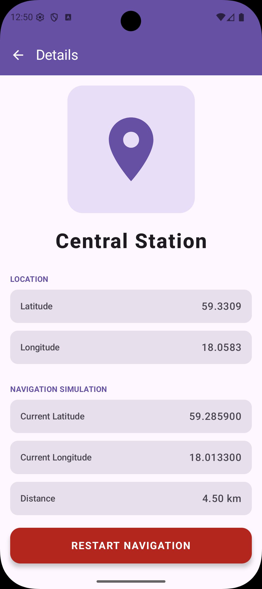

# NaviLite


NaviLite is a lightweight Android application designed to demonstrate modern Android development practices. It features a place listing and a real-time navigation simulation.

## Core Features

- **Place Listing**: A scrollable list of locations retrieved from a local JSON data source.
- **Rich Details View**: Displays detailed information for a selected place, including its coordinates.
- **Navigation Simulation**: A live simulation that calculates and updates current position, distance, and estimated time (ETA) using Kotlin Flows.
- **Dynamic UI**: Responsive design with a contextual Top Bar that adapts to navigation (back button and title changes).

## Implementation Details

This project strictly adheres to the following principles as requested:

- **Clean Architecture**: The codebase is partitioned into **Data**, **Domain**, and **Presentation** layers.
    - **Data**: Handles JSON parsing and repository implementations.
    - **Domain**: Contains pure business logic and UseCases (e.g., `SimulationUseCase`).
    - **Presentation**: Manages UI state and user interactions using Jetpack Compose.
- **MVVM/MVI Pattern**: ViewModels manage a single source of truth for UI state, ensuring a unidirectional data flow.
- **Kotlin Quality**: Leverages modern Kotlin features such as Coroutines, Flows, Result types, and Type-Safe Navigation.
- **State Handling**: State is managed via `StateFlow` and observed using `collectAsStateWithLifecycle` to ensure lifecycle awareness and prevent memory leaks.

## CI/CD

This project uses **GitHub Actions** for Continuous Integration and Deployment.

- **Automated Builds**: Every push to, and pull request targeting, the `main` branch triggers an automated build.
- **Unit Testing**: Tests are automatically executed as part of the pipeline to ensure code quality.
- **Build Artifacts**: A Debug APK is generated and uploaded as a GitHub Actions artifact for every successful build on the `main` branch.
- **Caching**: Gradle dependency caching is implemented to optimize and speed up build times.
- **Download**: Click this [link](https://github.com/DeepuGeorgeJacob/NavLite/actions) and select the latest workflow run to download the most recent **Debug APK**.


### Downloading the Build
You can download the latest **Debug APK** from the "Actions" tab in the GitHub repository. Select the latest successful workflow run and look for the `navi-lite-debug-apk` artifact at the bottom of the summary page.

## Screenshots

|           Place Listing (Home)            |               Navigation Details                | Navigation Details (Progress)  |
|:-----------------------------------------:|:-----------------------------------------------:|:------------------------------:|
|  |  |  |
## Tech Stack

- **UI**: Jetpack Compose (Material 3)
- **DI**: Hilt (Dagger)
- **Navigation**: Jetpack Compose Navigation (Type-Safe)
- **Concurrency**: Kotlin Coroutines & Flow
- **Testing**: JUnit, Turbine
- **CI**: GitHub Actions

## Setup Instructions

1.  **Open**: Open the project in **Android Studio Koala** or newer.
2.  **Sync**: Allow Gradle to sync and download dependencies.
3.  **Run**: Deploy the `navi-lite` module to an emulator or device (API 28+).

## Testing

Comprehensive unit tests are included for UseCases and ViewModels.
To execute them:
```bash
./gradlew test
```
